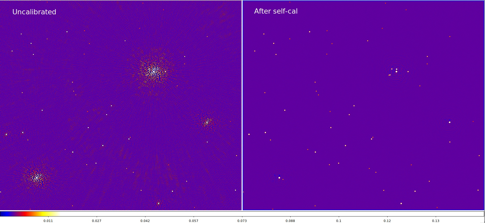

.. _example:

****************************
Example MID self-calibration
****************************

The current version of the pipeline was run as a Kubernetes job on the
DP Testing Platform, using the SKA-Mid simulation carried out by the ORCA Team
in PI12 with direction-independent gain corruptions.
The dataset is v12p1, described at `Continuum imaging standard outputs <https://confluence.skatelescope.org/display/SE/Continuum+imaging+standard+outputs>`_
and available on the Google Cloud storage bucket at `<https://console.cloud.google.com/storage/browser/ska1-simulation-data/simulations/continuum_simulations_SP-1901/mid/v12p1/v12p1_1/RASCIL/actual_ical_TGcal_900s>`_.

The command line parameters for this pipeline run were as follows:

.. code-block:: bash

   ./kubectl_run.sh \
       -n dp-hippo-fred-p \
       -d /shared/user/fred/MID \
       -i fdulwich/dp3-wsclean \
       -- \
       python3 selfcal_di.py \
       --clean_iters="20,100,500,500000" \
       --phase_only_cycles="0" \
       --wsclean_extra_params="-size 16384 16384 -scale 1asec -parallel-deconvolution 2500 -gridder wgridder" \
       v12p1_actual_ical_TGcal_900s.ms \
       selfcal_out1

The image below compares the output of the self-calibration pipeline with
the original (corrupted/uncalibrated) data, whch shows that artifacts
around the bright sources are visibly reduced.

Run-times
=========

The overall run-time was 44 minutes for about 6 GB of visibility data
(12090 baselines, 100 channels, 160 time samples; 190 million Stokes-I
visibilities), including 3 cycles of self-calibration with DP3 and WSClean,
and a final imaging step.

The run-times taken by each stage of the script are reported below:

.. code-block:: none

   ########################################
   #### Running wsclean [cycle 1/3]
   Inversion: 00:02:31.831122, prediction: 00:00:55.629219, deconvolution: 00:03:06.304363
   #### wsclean took 436.76 seconds

   #### Running DP3 [cycle 1/3]
   Total DP3 time     106.15 real      555.04 user       89.77 system
      6.4% ( 6756 ms) MSReader
      90.8% (   96  s) GainCal gaincal.
               6.4% ( 6168 ms) of it spent in predict
            33.6% (   32  s) of it spent in reordering visibility data
            14.8% (   14  s) of it spent in estimating gains and computing residuals
               0.1% (  139 ms) of it spent in writing gain solutions to disk
         Converged: 160, stalled: 0, non converged: 0, failed: 0
         Iters converged: 2, stalled: 0, non converged: 0, failed: 0
      31.3% (   33  s) MSWriter msout.
         0.6% (  206 ms) Updating buffer
      96.0% (   31  s) Creating task
      153.4% (   50  s) Writing (threaded)
   #### DP3 took 106.38 seconds
   ########################################

   ########################################
   #### Running wsclean [cycle 2/3]
   Inversion: 00:02:24.419986, prediction: 00:00:57.450648, deconvolution: 00:03:16.956590
   #### wsclean took 434.29 seconds

   #### Running DP3 [cycle 2/3]
   Total DP3 time     113.07 real      511.24 user       46.39 system
      37.6% (   42  s) MSReader
      62.2% (   70  s) GainCal gaincal.
               9.7% ( 6798 ms) of it spent in predict
            44.2% (   31  s) of it spent in reordering visibility data
            11.3% ( 7920 ms) of it spent in estimating gains and computing residuals
               0.3% (  178 ms) of it spent in writing gain solutions to disk
         Converged: 160, stalled: 0, non converged: 0, failed: 0
         Iters converged: 1, stalled: 0, non converged: 0, failed: 0
      10.5% (   11  s) MSUpdater msout.
   #### DP3 took 113.97 seconds
   ########################################

   ########################################
   #### Running wsclean [cycle 3/3]
   Inversion: 00:02:22.122717, prediction: 00:00:57.595298, deconvolution: 00:02:57.406168
   #### wsclean took 413.33 seconds

   #### Running DP3 [cycle 3/3]
   Total DP3 time      89.05 real      524.49 user       36.14 system
      6.9% ( 6165 ms) MSReader
      92.2% (   82  s) GainCal gaincal.
               8.5% ( 6954 ms) of it spent in predict
            38.2% (   31  s) of it spent in reordering visibility data
               9.6% ( 7863 ms) of it spent in estimating gains and computing residuals
               0.2% (  176 ms) of it spent in writing gain solutions to disk
         Converged: 160, stalled: 0, non converged: 0, failed: 0
         Iters converged: 1, stalled: 0, non converged: 0, failed: 0
      26.1% (   23  s) MSUpdater msout.
   #### DP3 took 89.31 seconds
   ########################################

   ########################################
   #### Running wsclean [final image]
   Inversion: 00:04:29.875266, prediction: 00:02:44.228613, deconvolution: 00:08:57.436365
   #### wsclean took 1002.58 seconds
   ########################################
