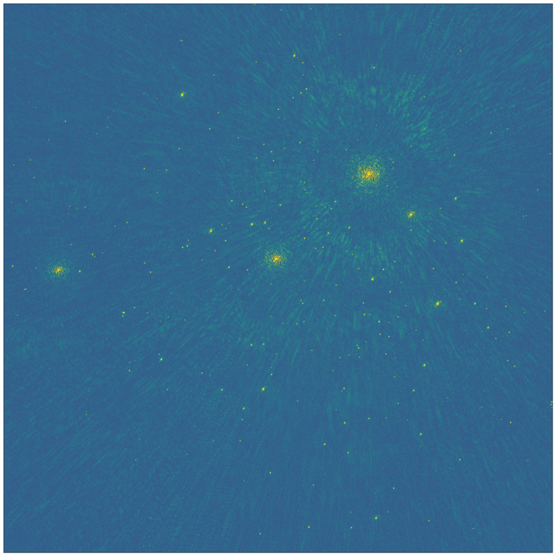
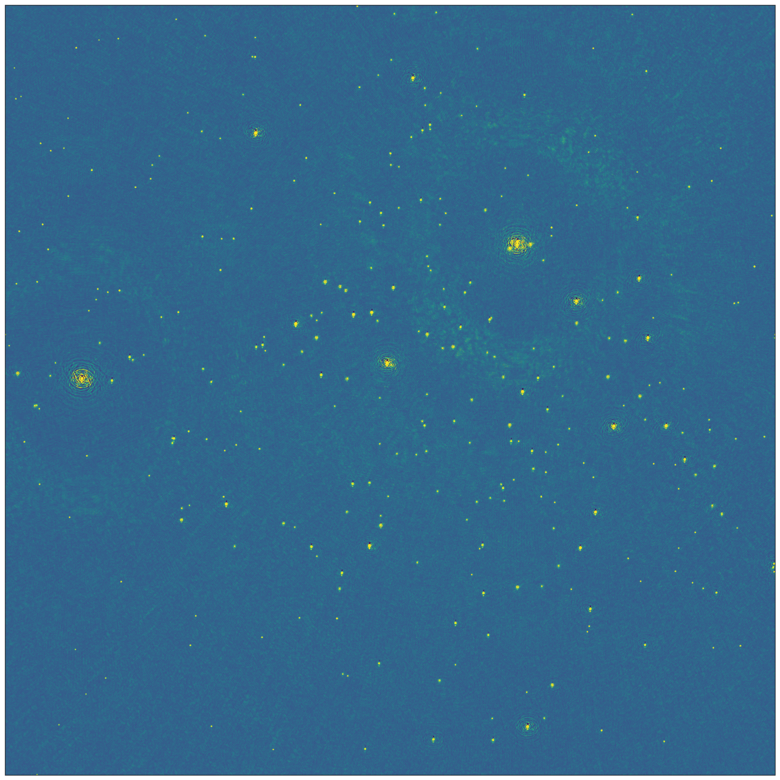
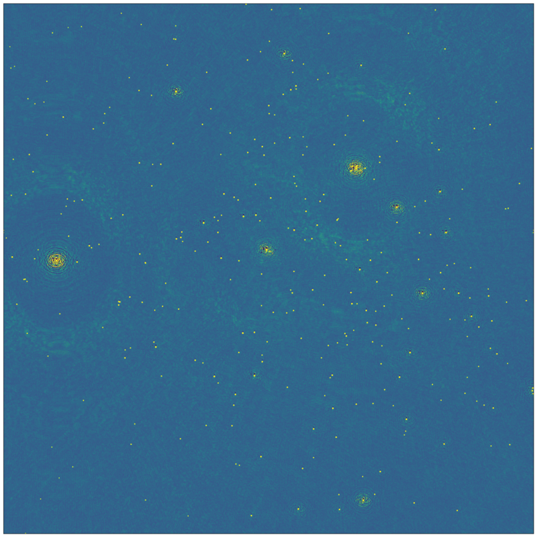

.. _example:

****************************
Example MID self-calibration
****************************

Setup and Parameters
====================

The current version of the pipeline was run as a SLURM job on the CSD3 cluster,
using the SKA-Mid simulation carried out by the ORCA Team in PI12 with direction-independent gain corruptions.

The dataset is v12p1, described at `Continuum imaging standard outputs <https://confluence.skatelescope.org/display/SE/Continuum+imaging+standard+outputs>`_
and available on the Google Cloud storage bucket at `<https://console.cloud.google.com/storage/browser/ska1-simulation-data/simulations/continuum_simulations_SP-1901/mid/v12p1/v12p1_1/RASCIL/actual_ical_TGcal_900s>`_.

The job script for this pipeline run was:

.. code-block:: bash

   #!/bin/bash
   #SBATCH --nodes=1
   #SBATCH --cpus-per-task=76
   #SBATCH --time=03:00:00
   #SBATCH --partition=icelake
   #SBATCH --signal=B:TERM@120

   export MS=/home/hpcmore1/rds/hpc-work/measurement_sets/v12p1_actual_ical_TGcal_900s.ms
   export SIF=/home/hpcmore1/rds/hpc-work/singularity_images/dp3-wsclean-mpi.sif
   export OUTDIR=/home/hpcmore1/rds/hpc-work/selfcal_pipeline_runs

   export NPIX=16384
   export SCALE=1asec
   export CLEAN_ITERS="10 100"
   export PHASE_ONLY_CYCLES="0"

   # Load environment
   source ~/.bashrc
   conda activate mid-selfcal

   # "exec" so that SIGTERM propagates to the pipeline executable
   exec mid-selfcal-pipeline \
      --singularity-image $SIF --base-outdir $OUTDIR \
      --clean-iters $CLEAN_ITERS --phase-only-cycles $PHASE_ONLY_CYCLES \
      --size $NPIX $NPIX --scale $SCALE \
      --input-ms $MS

Images produced
===============

Below is a comparison between the intermediate and final images produced by the pipeline at every stage for the above pipeline run.
Note that:  

- These have been reduced to 1,000 pixels, the original images being 16384 pixels wide.
- The colour scale is dynamically adjusted as a function of the background noise in each image.

First cycle
-----------

This is the first image, without calibration and using 10 Clean iterations:

Second cycle
------------

This is after a phase-only calibration against the model produced by WSClean
in the previous cycle, and 100 Clean iterations:

Final image
-----------

And lastly, after phase + amplitude calibration and cleaning down to the noise floor:

Run-times
=========

Running on a single CSD3 icelake node and using all 76 available logical cores,
the overall run time was 16 minutes for about 6 GB of visibility data
(12090 baselines, 100 channels, 160 time samples; 190 million Stokes-I
visibilities). As illustrated above, total of 2 cycles of self-calibration
with DP3 and WSClean were performed, as well as a final imaging step.

Here's an excerpt of the pipeline logs providing a breakdown of the run times
for each program:

.. code-block::

   [INFO - 2023-05-24 10:41:13,398 - mid-selfcal] Starting Major Cycle 1 / 2
   [INFO - 2023-05-24 10:41:13,398 - mid-selfcal] Running wsclean
   [DEBUG - 2023-05-24 10:43:18,984 - mid-selfcal.wsclean] Inversion: 00:00:52.324186, prediction: 00:00:14.787399, deconvolution: 00:00:40.977433
   [INFO - 2023-05-24 10:44:01,810 - mid-selfcal] wsclean finished in 168.41 seconds
   [INFO - 2023-05-24 10:44:01,813 - mid-selfcal] Running DP3
   [DEBUG - 2023-05-24 10:44:39,239 - mid-selfcal.DP3] Total DP3 time      36.94 real      146.44 user        7.81 system
   [DEBUG - 2023-05-24 10:44:39,239 - mid-selfcal.DP3]    13.1% ( 4850 ms) MSReader
   [DEBUG - 2023-05-24 10:44:39,239 - mid-selfcal.DP3]    84.7% (   31  s) GainCal gaincal.
   [DEBUG - 2023-05-24 10:44:39,239 - mid-selfcal.DP3]             5.9% ( 1839 ms) of it spent in predict
   [DEBUG - 2023-05-24 10:44:39,239 - mid-selfcal.DP3]            36.9% (   11  s) of it spent in reordering visibility data
   [DEBUG - 2023-05-24 10:44:39,239 - mid-selfcal.DP3]             6.3% ( 1956 ms) of it spent in estimating gains and computing residuals
   [DEBUG - 2023-05-24 10:44:39,240 - mid-selfcal.DP3]             1.4% (  441 ms) of it spent in writing gain solutions to disk
   [DEBUG - 2023-05-24 10:44:39,240 - mid-selfcal.DP3]         Converged: 160, stalled: 0, non converged: 0, failed: 0
   [DEBUG - 2023-05-24 10:44:39,240 - mid-selfcal.DP3]         Iters converged: 1, stalled: 0, non converged: 0, failed: 0
   [DEBUG - 2023-05-24 10:44:39,240 - mid-selfcal.DP3]    17.0% ( 6272 ms) MSUpdater msout.
   [INFO - 2023-05-24 10:44:39,779 - mid-selfcal] DP3 finished in 37.97 seconds
   [INFO - 2023-05-24 10:44:39,781 - mid-selfcal] Starting Major Cycle 2 / 2
   [INFO - 2023-05-24 10:44:39,781 - mid-selfcal] Running wsclean
   [DEBUG - 2023-05-24 10:47:58,624 - mid-selfcal.wsclean] Inversion: 00:01:07.944942, prediction: 00:00:29.750302, deconvolution: 00:01:23.237502
   [INFO - 2023-05-24 10:48:08,810 - mid-selfcal] wsclean finished in 209.03 seconds
   [INFO - 2023-05-24 10:48:08,812 - mid-selfcal] Running DP3
   [DEBUG - 2023-05-24 10:48:48,732 - mid-selfcal.DP3] Total DP3 time      39.44 real      151.82 user        8.16 system
   [DEBUG - 2023-05-24 10:48:48,732 - mid-selfcal.DP3]    17.1% ( 6732 ms) MSReader
   [DEBUG - 2023-05-24 10:48:48,733 - mid-selfcal.DP3]    80.8% (   31  s) GainCal gaincal.
   [DEBUG - 2023-05-24 10:48:48,733 - mid-selfcal.DP3]             5.3% ( 1702 ms) of it spent in predict
   [DEBUG - 2023-05-24 10:48:48,733 - mid-selfcal.DP3]            39.4% (   12  s) of it spent in reordering visibility data
   [DEBUG - 2023-05-24 10:48:48,733 - mid-selfcal.DP3]             4.2% ( 1325 ms) of it spent in estimating gains and computing residuals
   [DEBUG - 2023-05-24 10:48:48,733 - mid-selfcal.DP3]             0.2% (   78 ms) of it spent in writing gain solutions to disk
   [DEBUG - 2023-05-24 10:48:48,733 - mid-selfcal.DP3]         Converged: 160, stalled: 0, non converged: 0, failed: 0
   [DEBUG - 2023-05-24 10:48:48,733 - mid-selfcal.DP3]         Iters converged: 0, stalled: 0, non converged: 0, failed: 0
   [DEBUG - 2023-05-24 10:48:48,733 - mid-selfcal.DP3]    17.0% ( 6703 ms) MSUpdater msout.
   [INFO - 2023-05-24 10:48:49,479 - mid-selfcal] DP3 finished in 40.67 seconds
   [INFO - 2023-05-24 10:48:49,480 - mid-selfcal] Making final image
   [INFO - 2023-05-24 10:48:49,480 - mid-selfcal] Running wsclean
   [DEBUG - 2023-05-24 10:56:52,518 - mid-selfcal.wsclean] Inversion: 00:02:06.212229, prediction: 00:01:29.190341, deconvolution: 00:04:09.359790
   [INFO - 2023-05-24 10:57:02,867 - mid-selfcal] wsclean finished in 493.39 seconds
   [INFO - 2023-05-24 10:57:02,869 - mid-selfcal] Pipeline run: SUCCESS
